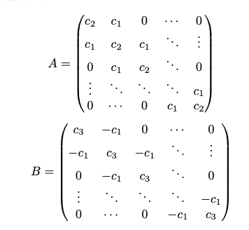
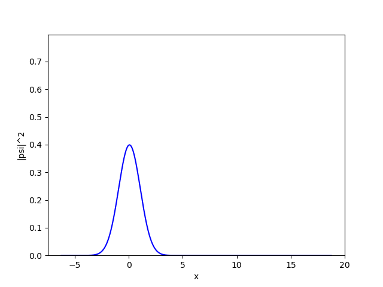
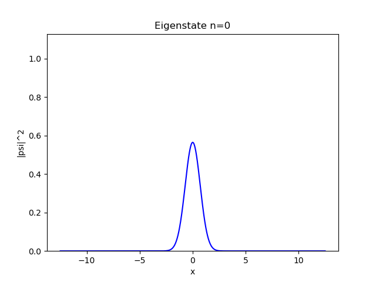
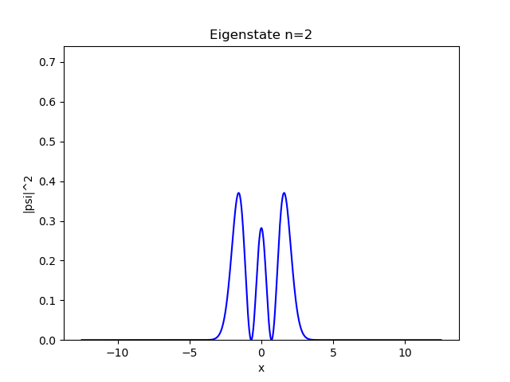
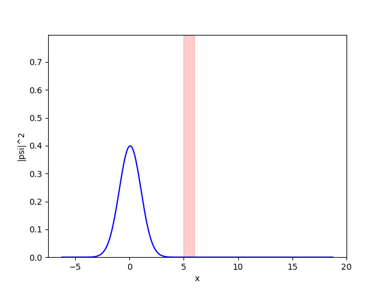

***1D Time-Dependent Schrödinger Equation Solver***

A simple numerical solver for the 1D time-dependent Schrödinger equation using finite-difference methods.
The goal of the project is mostly educational — to experiment with wave packets, potentials, and time evolution, and to generate animations of quantum behavior.

The main equation solved is: \
$i\hbar \frac{\partial \Psi}{\partial t} 
= -\frac{\hbar^2}{2m} \frac{\partial^2 \Psi}{\partial x^2} + V(x)\Psi$ \
The solver also includes a few example potentials and scripts for visualizing how different wave packets evolve.

**Installation** \
The project uses only standard scientific Python libraries:\
`pip install numpy scipy matplotlib ipython`

**Numerical method**\
Space is discretized as: \
$x_j = x_{min} + j\Delta x, \space j = 0, 1, ..., J-1,$ \
Time is discretized as: \
$t_n = n \Delta t$ \
Spatial derivative is approximated with a second-order finite difference: \
$\frac{\partial^2 \Psi}{\partial x^2}(x_j, t_n) \approx \frac{\Psi_{j+1}^n - 2\Psi_{j}^n + \Psi_{j-1}^n}{(\Delta x)^2}$ \
Time derivative is approximated with forward-difference: \
$\frac{\partial \Psi}{\partial t}(x_j, t_n) \approx \frac{\Psi_{j}^{n+1} - \Psi_{j}^n}{\Delta t}$ \
The final equation is a Crank–Nicolson scheme, averaging the second-order spatial differences at time steps n and n+1: \
$i\hbar(\frac{\Psi_{j}^{n+1} - \Psi_{j}^n}{\Delta t}) = \frac{1}{2}((-\frac{\hbar}{2m}(\frac{\Psi_{j+1}^n - 2\Psi_{j}^n + \Psi_{j-1}^n}{(\Delta x)^2}) + V(x)\Psi_j^n) + (-\frac{\hbar}{2m}(\frac{\Psi_{j+1}^{n+1} - 2\Psi_{j}^{n+1} + \Psi_{j-1}^{n+1}}{(\Delta x)^2}) + V(x)\Psi_j^{n+1}))$ 

Carrying over n and n+1 terms to different sides we get the following equation: \
$i \hbar \frac{\Psi_j^{n+1}}{\Delta t} - \frac{1}{2} \left( -\frac{\hbar^2}{2m} \frac{\Psi_{j+1}^{n+1} - 2 \Psi_j^{n+1} + \Psi_{j-1}^{n+1}}{(\Delta x)^2} + V_j \Psi_j^{n+1} \right) = i \hbar \frac{\Psi_j^n}{\Delta t} + \frac{1}{2} \left( -\frac{\hbar^2}{2m} \frac{\Psi_{j+1}^{n} - 2 \Psi_j^{n} + \Psi_{j-1}^{n}}{(\Delta x)^2} + V_j \Psi_j^n \right)$ 

This can be rewritten in matrix form: \
$A\Phi^{n+1} = B\Phi^{n}$ \
where the matrices A and B have the tridiagonal pattern \
 \
where \
$c_1=\frac{\hbar^2}{2m}\lambda, \space c_2=i\hbar -\frac{\hbar^2}{m}\lambda - \frac{V\Delta t}{2}, \space c_3=i\hbar +\frac{\hbar^2}{m}\lambda + \frac{V\Delta t}{2}, \space \lambda=\frac{\Delta t}{2\Delta x^2}$

Initial wave function is presented by the gaussian wave packet: \
$(\frac{1}{2\sigma^2 \pi})^{\frac{1}{4}} \exp(i k_0 x) \exp(-\frac{(x - x_0)^2}{4 \sigma^2})$

**Examples** \
Below are some of the animations produced using the solver.

*Free Particle* \
For a free particle, the potential is zero: \
$V(x)=0$ \
The wave packet travels and spreads:

*Harmonic Oscillator* \
Potential: \
$V(x) = kx^2$ \
The packet oscillates in the potential well and periodically squeezes/spreads:

The eigenstates of the harmonic oscillator are represented by the following function: \
$\frac{1}{\sqrt{2^n n!}}(\frac{m \omega}{\pi \hbar})^\frac{1}{4} H_n (\sqrt{\frac{m \omega}{\hbar}}x) \exp(-\frac{m \omega x^2}{2 \hbar})$ \
First few eigenstates:

*Barrier Tunneling* \
When the wave packet encounters a potential barrier, part of it reflects and part “tunnels” through:

